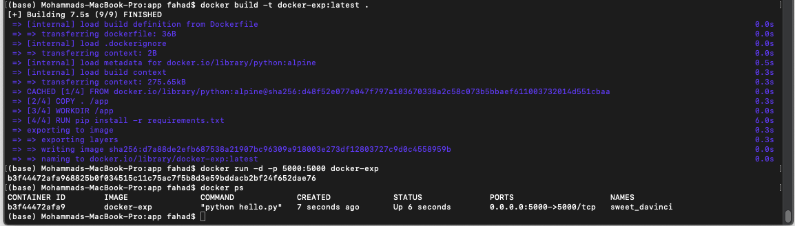
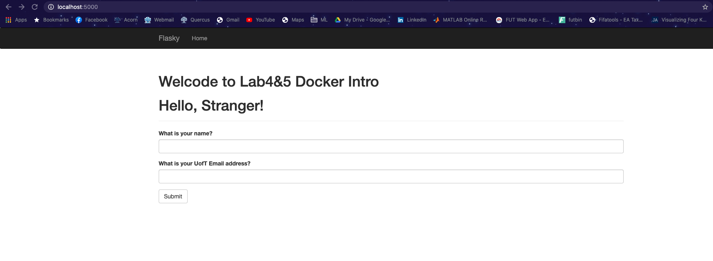
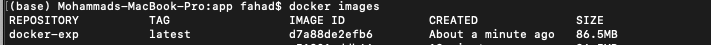

# ECE444-F2020-Lab3

Mohammad Fahad Rahman

This repo is a clone of: https://github.com/miguelgrinberg/flasky

## 1)
DockerFile located in app/DockerFile

To build image use command: docker build -t docker-exp:latest .
To run docker container use command: docker run -d -p 5000:5000 docker-exp

## 2)

## 3)
Containers are running instances of an image. The image consists of all the entities necessary to succesfully run the application (code, binary files, packages etc), and the container encapsulates the environment in which the image can be be run. You can have the same image running on multiple containers. 